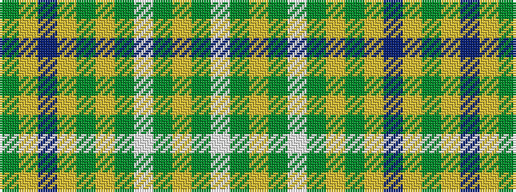

GYBYGYGWGYGW

It is a 12 stripe tartan.

<figure class="pat-woven">

<figcaption>idealised sample</figcaption>
</figure>

## Colour Sequence



## Tartans with this colour sequence

| Tartans |
|---------------|
| [Green Bay, Wisconsin (District)](/setts/s12/g8ly2db3ly2g16ly10g3w6g1ly3g1w6~x2/)|
||
