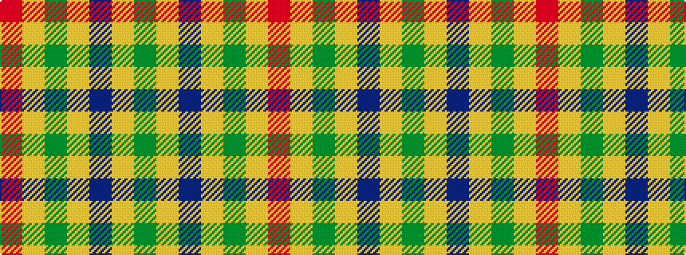

GYBYGYR

It is a 7 stripe tartan.

<figure class="pat-woven">

<figcaption>idealised sample</figcaption>
</figure>

## Colour Sequence



## Tartans with this colour sequence

| Tartans |
|---------------|
| [Lochwood Estate Check](/variants/s7/r4ly3g4ly4b4ly4g4~x2/)|
||
