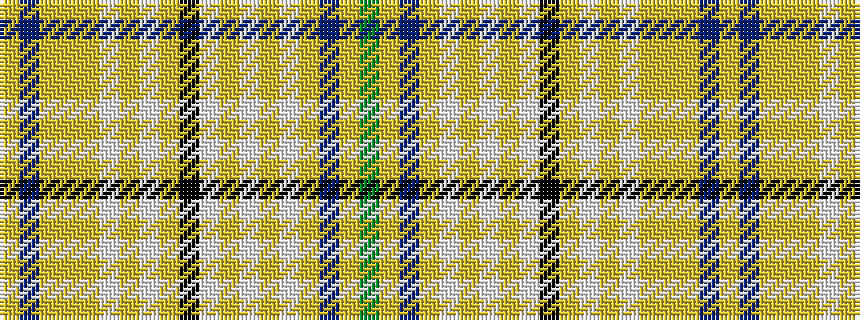

GYBYWYWYWKYWYWYYYBY

It is a 19 stripe tartan.

<figure class="pat-woven">

<figcaption>idealised sample</figcaption>
</figure>

## Colour Sequence



## Tartans with this colour sequence

| Tartans |
|---------------|
| [Tenon Tours](/variants/s19/g40lo3dr12ly3w1ly1w2ly1w1k4ly1w1ly1w1lo1ly1lo3dr12lo3~x2/)|
||
