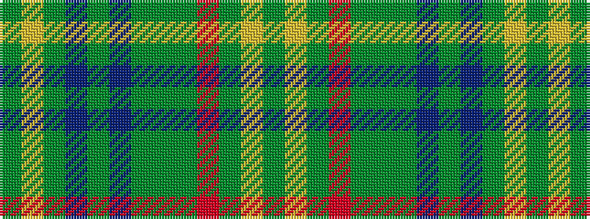

GYGBGBGGGRGYG

It is a 13 stripe tartan.

<figure class="pat-woven">

<figcaption>idealised sample</figcaption>
</figure>

## Colour Sequence



## Tartans with this colour sequence

| Tartans |
|---------------|
| [U.S. Seabees (Military)](/setts/s13/g72lo2g10r9g2dy9g2db9g2b9g9lo2g72~x2/)|
||
