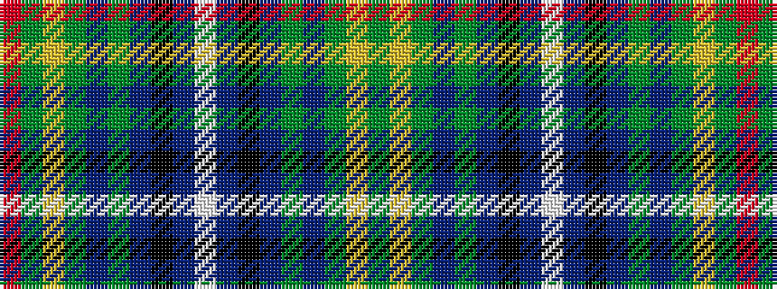

GYGBGBKBWBKBGBGYGR

It is a 18 stripe tartan.

<figure class="pat-woven">

<figcaption>idealised sample</figcaption>
</figure>

## Colour Sequence



## Tartans with this colour sequence

| Tartans |
|---------------|
| [Sarasota - Dunfermline](/setts/s18/g6ly2g3b4g14b36k2b3w2b3k2b36g14b4g3ly2g6r2~x2/)|
||
| [Sarasota - Dunfermline District Tartan Tartan Number: 5897. Earliest known date: July 2003 This tartan for Robert Nicol of Dunfermline commemorates the twinning of the Scottish town of Dunfermline with Sarasota, Florida, USA.. See products available Copyright © Blair Urquhart, Comrie, 2015](/setts/s18/dg6ly2dg3t4dg14t36k2t3w2t3k2t36dg14t4dg3ly2dg6r1~x2/)|
||
