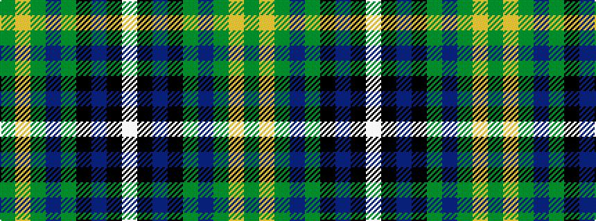

GYGBGKBKW

It is a 9 stripe tartan.

<figure class="pat-woven">

<figcaption>idealised sample</figcaption>
</figure>

## Colour Sequence



## Tartans with this colour sequence

| Tartans |
|---------------|
| [National Wedding](/variants/s9/dg22lo2dg4dp3dg4k20db20k1lb3~x2/)|
||
