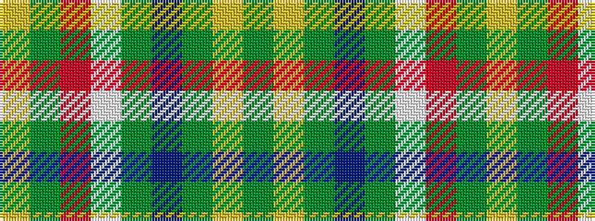

GYGBGWRGY

It is a 9 stripe tartan.

<figure class="pat-woven">

<figcaption>idealised sample</figcaption>
</figure>

## Colour Sequence



## Tartans with this colour sequence

| Tartans |
|---------------|
| [Antrim County Crest (Fashion)](/setts/s9/g4ly9g3db4g3w3r32g4ly3~x2/)|
||
