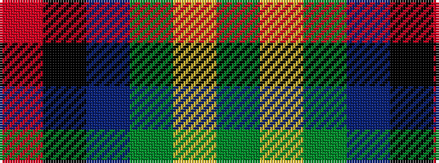

GYGBKR

It is a 6 stripe tartan.

<figure class="pat-woven">

<figcaption>idealised sample</figcaption>
</figure>

## Colour Sequence



## Tartans with this colour sequence

| Tartans |
|---------------|
| [Waterford Irish County Tartan](/variants/s6/dg42ly2g16dt7k16r5~x2/)|
||
