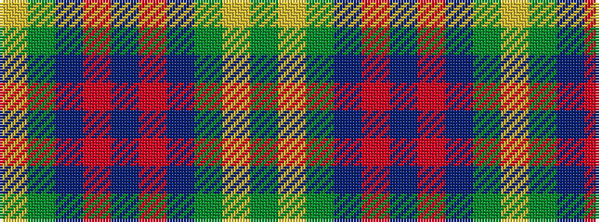

GYGBRBRBGY

It is a 10 stripe tartan.

<figure class="pat-woven">

<figcaption>idealised sample</figcaption>
</figure>

## Colour Sequence



## Tartans with this colour sequence

| Tartans |
|---------------|
| [Hamilton of Clayton (Personal)](/variants/s10/dg3lr3dg18db14r5db14r5db14dg21lr3~x2/)|
||
