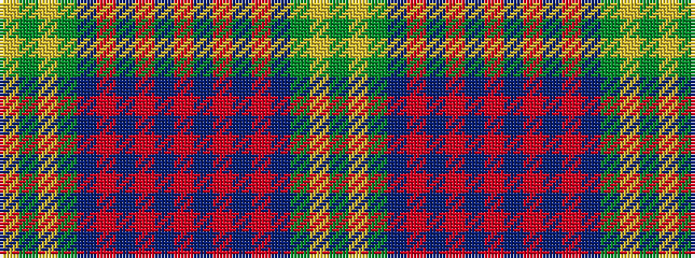

GYGBRBRBRBRBRBGYGY

It is a 18 stripe tartan.

<figure class="pat-woven">

<figcaption>idealised sample</figcaption>
</figure>

## Colour Sequence



## Tartans with this colour sequence

| Tartans |
|---------------|
| [Unidentified Lindley #2](/variants/s18/r18db2r2db2r3db14dg29ly1dg2ly4~x2/)|
||
