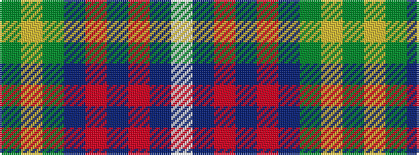

GYGBRBRBW

It is a 9 stripe tartan.

<figure class="pat-woven">

<figcaption>idealised sample</figcaption>
</figure>

## Colour Sequence



## Tartans with this colour sequence

| Tartans |
|---------------|
| [Blue Blas Alba](/variants/s9/y4ly2y39dt10o4dt4r4dt25w3~x2/)|
||
