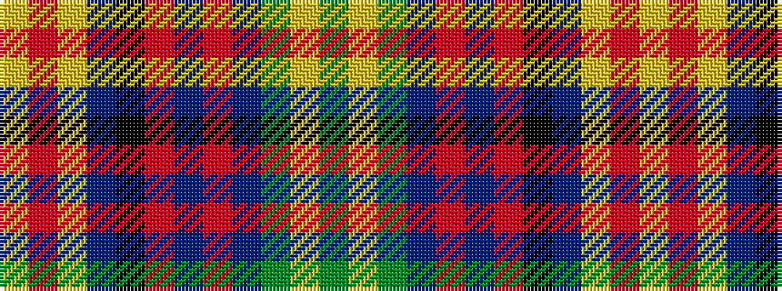

GYGBRBRKBYRY

It is a 12 stripe tartan.

<figure class="pat-woven">

<figcaption>idealised sample</figcaption>
</figure>

## Colour Sequence



## Tartans with this colour sequence

| Tartans |
|---------------|
| [Blaylock Hunting](/setts/s12/g4lr2g8do8o2do8o16k2do5lr2o5ly2~x2/)|
||
