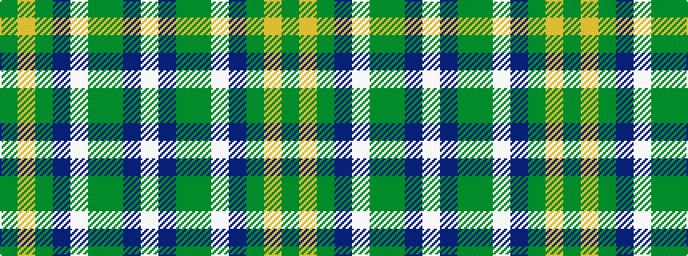

GYGBWGGBW

It is a 9 stripe tartan.

<figure class="pat-woven">

<figcaption>idealised sample</figcaption>
</figure>

## Colour Sequence



## Tartans with this colour sequence

| Tartans |
|---------------|
| [Drummond of Perth Dress (Dance)](/variants/s9/dg41lo3g7n3w24dg10g7n7w3~x2/)|
||
