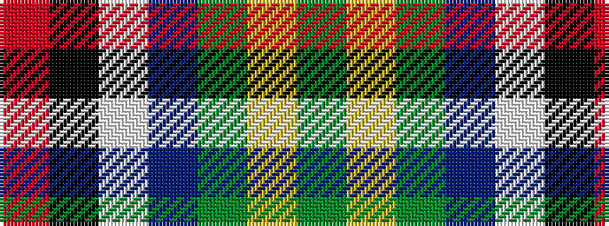

GYGBWKR

It is a 7 stripe tartan.

<figure class="pat-woven">

<figcaption>idealised sample</figcaption>
</figure>

## Colour Sequence



## Tartans with this colour sequence

| Tartans |
|---------------|
| [Barbour Corporate Tartan](/variants/s7/y4ly2y21do11w2k20r3~x2/)|
||
