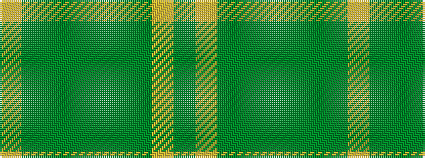

GYGGGGGGY

It is a 9 stripe tartan.

<figure class="pat-woven">

<figcaption>idealised sample</figcaption>
</figure>

## Colour Sequence



## Tartans with this colour sequence

| Tartans |
|---------------|
| [Dalwhinnie](/setts/s9/dg70ly6y28g56y5g11y5g11lo12/)|
||
