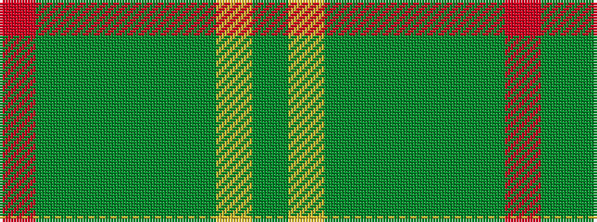

GYGGGGGR

It is a 8 stripe tartan.

<figure class="pat-woven">

<figcaption>idealised sample</figcaption>
</figure>

## Colour Sequence



## Tartans with this colour sequence

| Tartans |
|---------------|
| [Unidentified #40](/variants/s8/dyii13ly3dyii13dg23dyi16dy13dyii23r5~x2/)|
||
