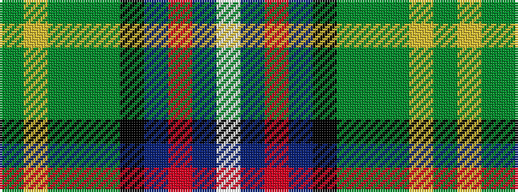

GYGGGKBRBW

It is a 10 stripe tartan.

<figure class="pat-woven">

<figcaption>idealised sample</figcaption>
</figure>

## Colour Sequence



## Tartans with this colour sequence

| Tartans |
|---------------|
| [Bullman (Name)](/variants/s10/g2ly1g13y2g1k12db10r1db1w2~x2/)|
||
