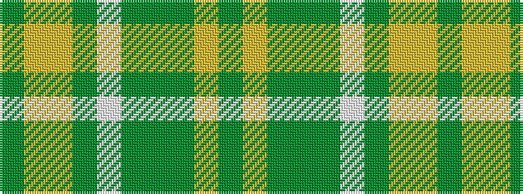

GYGGGWGYYG

It is a 10 stripe tartan.

<figure class="pat-woven">

<figcaption>idealised sample</figcaption>
</figure>

## Colour Sequence



## Tartans with this colour sequence

| Tartans |
|---------------|
| [Rams Timeless](/setts/s10/g12lo6lo16g10w6g8g12g70lo9g7/)|
||
