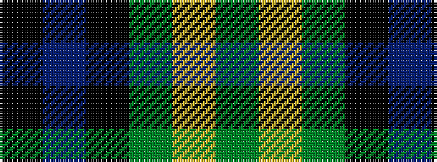

GYGKBK

It is a 6 stripe tartan.

<figure class="pat-woven">

<figcaption>idealised sample</figcaption>
</figure>

## Colour Sequence



## Tartans with this colour sequence

| Tartans |
|---------------|
| [Graham W](/setts/dg21lr2dg4k17n14k3/)|
||
| [Wilson's, No 160](/variants/s6/g21ly2g4k16p14k3~x2/)|
||
