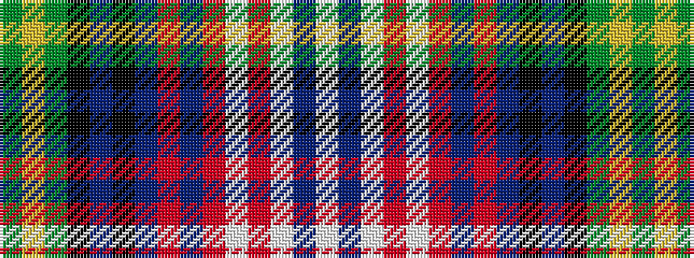

GYGKBKBRBRWRWBW

It is a 15 stripe tartan.

<figure class="pat-woven">

<figcaption>idealised sample</figcaption>
</figure>

## Colour Sequence



## Tartans with this colour sequence

| Tartans |
|---------------|
| [Watson - Kirby (Personal)](/variants/s15/dg10ly6dg20k20db20k6db8r6db20r6w4r16w4db6w1~x2/)|
||
