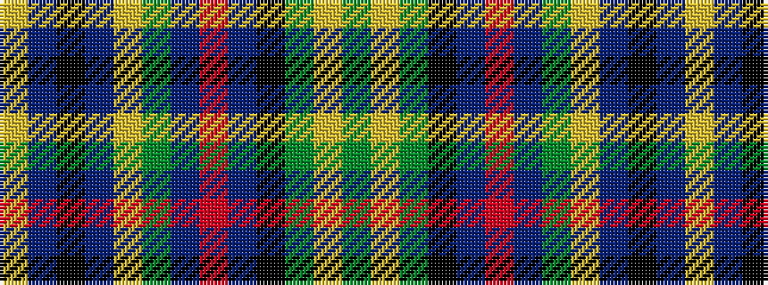

GYGKBRBGYBKBY

It is a 13 stripe tartan.

<figure class="pat-woven">

<figcaption>idealised sample</figcaption>
</figure>

## Colour Sequence



## Tartans with this colour sequence

| Tartans |
|---------------|
| [Greylock](/setts/s13/g11lr2g12k3t15r3t15g19lr2t3k2t3lo3~x2/)|
||
