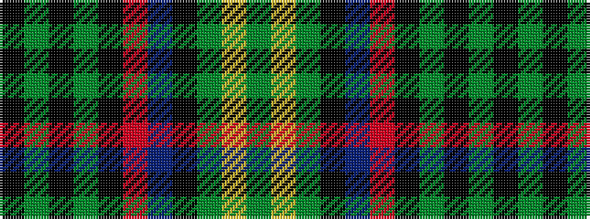

GYGKBRKGKGK

It is a 11 stripe tartan.

<figure class="pat-woven">

<figcaption>idealised sample</figcaption>
</figure>

## Colour Sequence



## Tartans with this colour sequence

| Tartans |
|---------------|
| [State Seal of South Dakota (Fashion)](/setts/s11/dy49lo3dy6k7b21r4k16g12k1dy12k3~x2/)|
||
