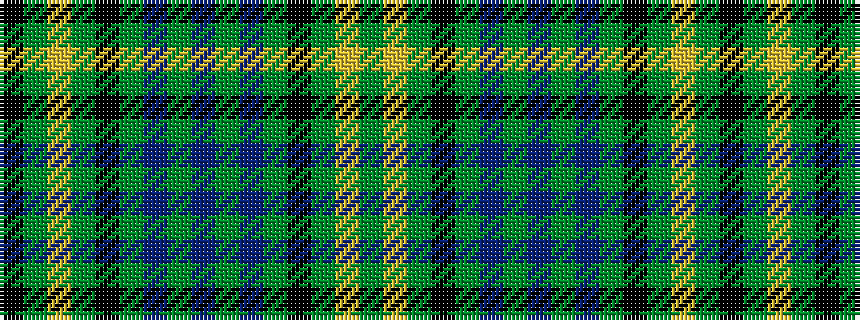

GYGKGBGBGBGKGYGK

It is a 16 stripe tartan.

<figure class="pat-woven">

<figcaption>idealised sample</figcaption>
</figure>

## Colour Sequence



## Tartans with this colour sequence

| Tartans |
|---------------|
| [Oliver Hunting](/setts/s16/t62g5t3g22k3g3ly3g3k6~x2/)|
||
