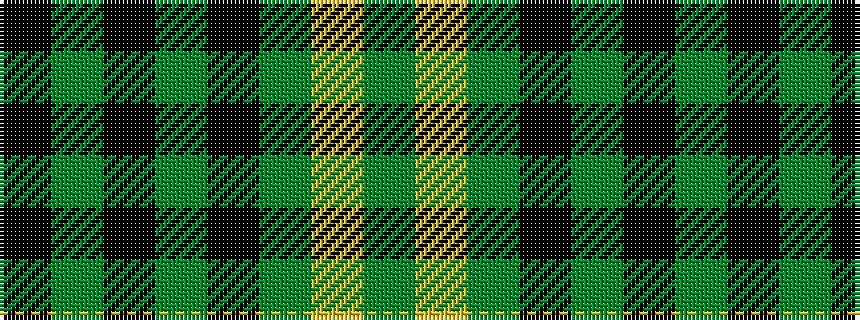

GYGKGKGK

It is a 8 stripe tartan.

<figure class="pat-woven">

<figcaption>idealised sample</figcaption>
</figure>

## Colour Sequence



## Tartans with this colour sequence

| Tartans |
|---------------|
| [West Point](/setts/s8/k13y1k1y1k4y10ly1y1~x6/)|
||
