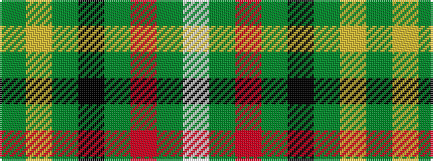

GYGKGRGW

It is a 8 stripe tartan.

<figure class="pat-woven">

<figcaption>idealised sample</figcaption>
</figure>

## Colour Sequence



## Tartans with this colour sequence

| Tartans |
|---------------|
| [Hanby (Personal)](/variants/s8/g21ly10g20k3g10r3g10w3~x2/)|
||
