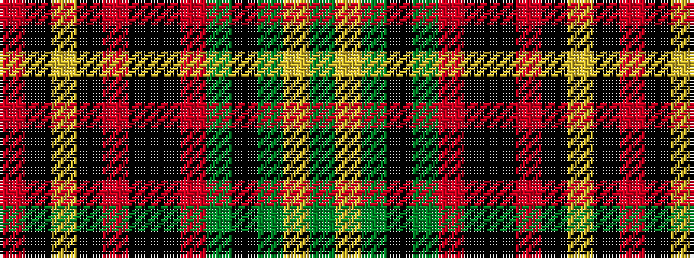

GYGKGRKKRKYKR

It is a 13 stripe tartan.

<figure class="pat-woven">

<figcaption>idealised sample</figcaption>
</figure>

## Colour Sequence



## Tartans with this colour sequence

| Tartans |
|---------------|
| [Mandela, Commemorative](/setts/s13/g8ly2g2k6g11r2ki12k12r2k6ly2k4r3~x2/)|
||
