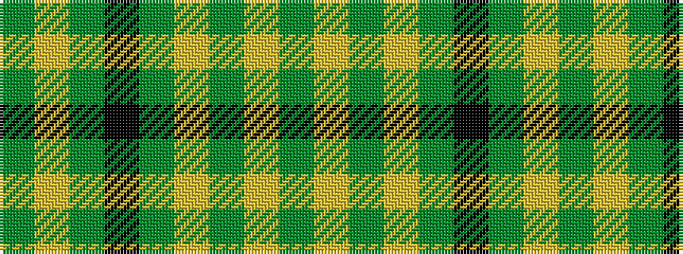

GYGKGYGYG

It is a 9 stripe tartan.

<figure class="pat-woven">

<figcaption>idealised sample</figcaption>
</figure>

## Colour Sequence



## Tartans with this colour sequence

| Tartans |
|---------------|
| [Marie Curie Fields of Hope](/setts/s9/gi16ly2gi4ly2gi5k14g28ly2g7~x2/)|
||
