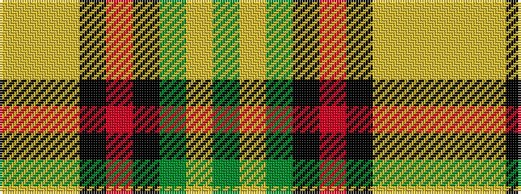

GYGKRKYYY

It is a 9 stripe tartan.

<figure class="pat-woven">

<figcaption>idealised sample</figcaption>
</figure>

## Colour Sequence



## Tartans with this colour sequence

| Tartans |
|---------------|
| [Eire](/variants/s9/dg6lr2dg10k3r1k3lo10lr2lo6~x4/)|
||
| [Eire (District?)](/variants/s9/g6lr2g10k3r1k3lo10lr2lo6~x4/)|
||
