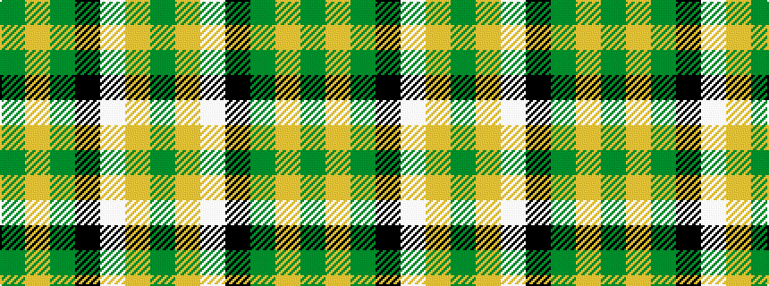

GYGKWYG

It is a 7 stripe tartan.

<figure class="pat-woven">

<figcaption>idealised sample</figcaption>
</figure>

## Colour Sequence



## Tartans with this colour sequence

| Tartans |
|---------------|
| [Pollock](/variants/s7/g3lo16w4k6g28lo1g3~x4/)|
||
| [Pollock (Name)](/variants/s7/g6lo2g32k8w6lo20g5~x2/)|
||
