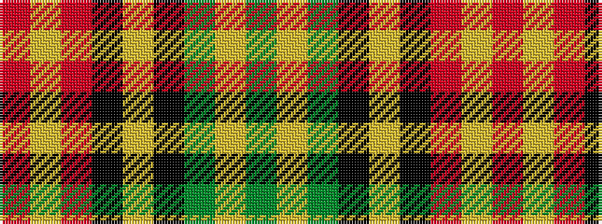

GYGKYKRYR

It is a 9 stripe tartan.

<figure class="pat-woven">

<figcaption>idealised sample</figcaption>
</figure>

## Colour Sequence



## Tartans with this colour sequence

| Tartans |
|---------------|
| [Grant, Champion](/setts/s9/r14ly2r6k1ly14k1g10ly1g10~x2/)|
||
