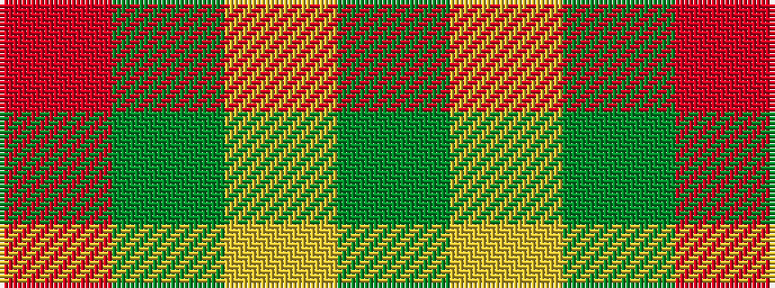

GYGR

It is a 4 stripe tartan.

<figure class="pat-woven">

<figcaption>idealised sample</figcaption>
</figure>

## Colour Sequence



## Tartans with this colour sequence

| Tartans |
|---------------|
| [Lugo (2013)](/setts/s4/r10dg4lo1~x8/)|
||
| [Lugo (2013)](/setts/s4/r10dg4ly1~x8/)|
||
| [Scottish Watch](/setts/s4/r104dg39lo4~x2/)|
||
