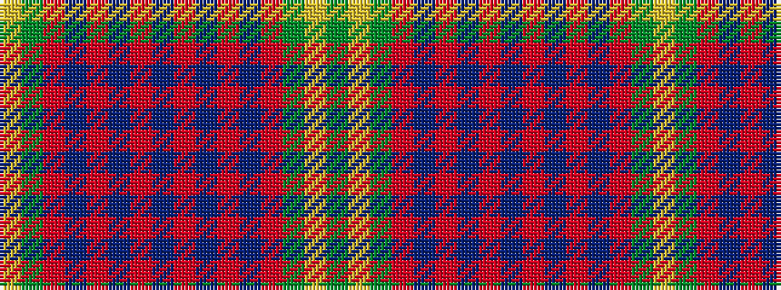

GYGRBRBRBRBRBRGY

It is a 16 stripe tartan.

<figure class="pat-woven">

<figcaption>idealised sample</figcaption>
</figure>

## Colour Sequence



## Tartans with this colour sequence

| Tartans |
|---------------|
| [Durie Clan Tartan](/variants/s16/db12r1db1r1db1r4g12ly1g2~x4/)|
||
