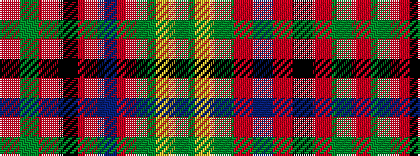

GYGRBRKRGR

It is a 10 stripe tartan.

<figure class="pat-woven">

<figcaption>idealised sample</figcaption>
</figure>

## Colour Sequence



## Tartans with this colour sequence

| Tartans |
|---------------|
| [Seton](/setts/s10/dg6lr1dg12r4db4r2k4r32dg1r2~x2/)|
||
