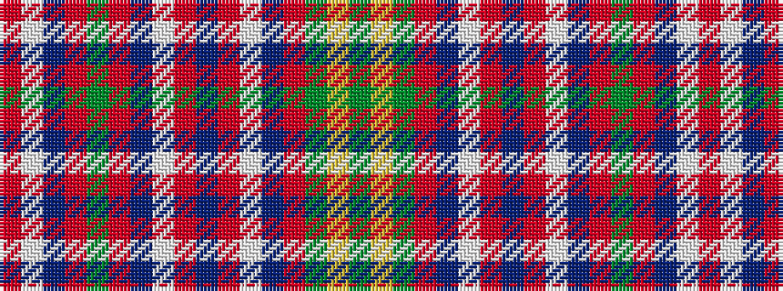

GYGRBWRBRWBRGRBWR

It is a 17 stripe tartan.

<figure class="pat-woven">

<figcaption>idealised sample</figcaption>
</figure>

## Colour Sequence



## Tartans with this colour sequence

| Tartans |
|---------------|
| [King George IV - 1824 (Artefact)](/setts/s17/r24w1dp1r3dg24r3dp1w1r3dp6r3w1dp1r24dg3lr3dg3~x2/)|
||
