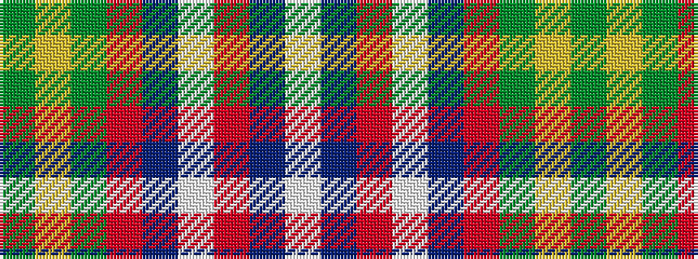

GYGRBWRBW

It is a 9 stripe tartan.

<figure class="pat-woven">

<figcaption>idealised sample</figcaption>
</figure>

## Colour Sequence



## Tartans with this colour sequence

| Tartans |
|---------------|
| [Telfer](/variants/s9/g9lo2g6r35db6lb1ri20db5lb2~x2/)|
||
| [Telfer (Name)](/variants/s9/g9ly2g6r35db6lb1ri20db5lb2~x2/)|
||
