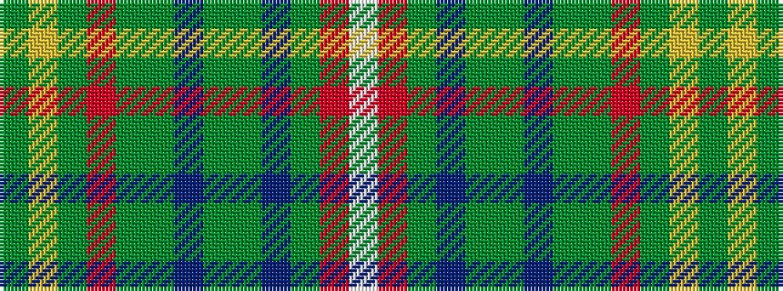

GYGRGGBGGBGRW

It is a 13 stripe tartan.

<figure class="pat-woven">

<figcaption>idealised sample</figcaption>
</figure>

## Colour Sequence



## Tartans with this colour sequence

| Tartans |
|---------------|
| [Kerr of Ardgowan Hunting (Personal)](/setts/s13/g2lo1dg42r2dg6g1db1g1dg4t4dg1r1w1~x2/)|
||
