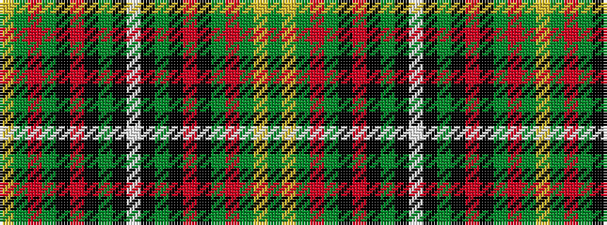

GYGRGKRKGKWKGKRKGRGY

It is a 20 stripe tartan.

<figure class="pat-woven">

<figcaption>idealised sample</figcaption>
</figure>

## Colour Sequence



## Tartans with this colour sequence

| Tartans |
|---------------|
| [Unidentified Cant #10](/variants/s20/dg9ly5dg57r1dg8k40m7k4dg4k2w4~x2/)|
||
