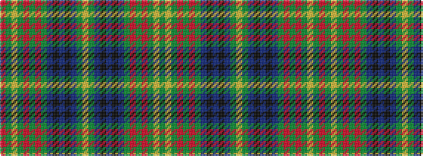

GYGRGRGBKBKBGYGBKBKBGRGRGYGR

It is a 28 stripe tartan.

<figure class="pat-woven">

<figcaption>idealised sample</figcaption>
</figure>

## Colour Sequence



## Tartans with this colour sequence

| Tartans |
|---------------|
| [Holmes](/setts/s28/ly4g39db9k3db5k3db9g32r2g3r2g5ly2g3r3~x2/)|
||
