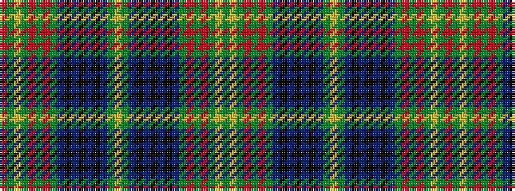

GYGRGRGBKBKBKBGYGBKBKBKBGRGRGYGR

It is a 32 stripe tartan.

<figure class="pat-woven">

<figcaption>idealised sample</figcaption>
</figure>

## Colour Sequence



## Tartans with this colour sequence

| Tartans |
|---------------|
| [King Edward VII](/variants/s32/ly8g84b21k10b10k10b10k10b21g62r3g6r3g10ly3g5r6/)|
||
