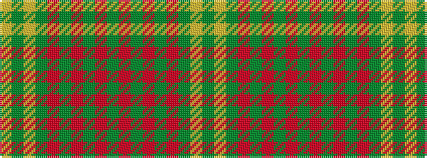

GYGRGRGRGRGRGRGYGY

It is a 18 stripe tartan.

<figure class="pat-woven">

<figcaption>idealised sample</figcaption>
</figure>

## Colour Sequence



## Tartans with this colour sequence

| Tartans |
|---------------|
| [Prince of Wales Fashion Weavers Tartan](/variants/s18/g3r6g2r1g2r1g16lr1g2lr3~x4/)|
||
