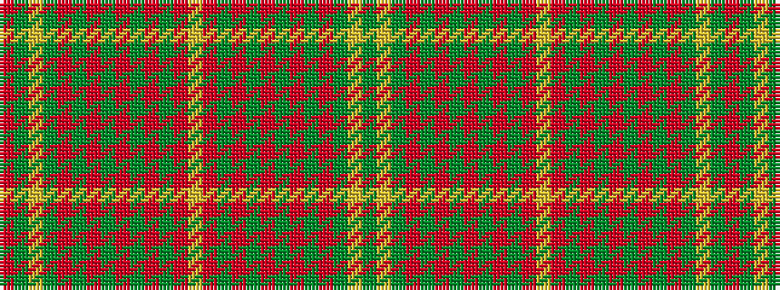

GYGRGRGRGRGRYRGRGRGRGRGYGR

It is a 26 stripe tartan.

<figure class="pat-woven">

<figcaption>idealised sample</figcaption>
</figure>

## Colour Sequence



## Tartans with this colour sequence

| Tartans |
|---------------|
| [Hayes](/setts/s26/r2dg1ly1dg12r1dg1r1dg4r17dg3r2dg1r2lr2~x4/)|
||
