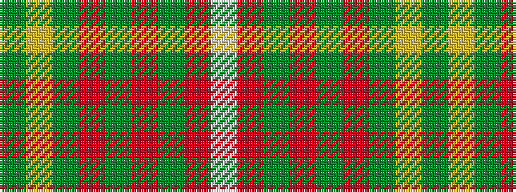

GYGRGRGRW

It is a 9 stripe tartan.

<figure class="pat-woven">

<figcaption>idealised sample</figcaption>
</figure>

## Colour Sequence



## Tartans with this colour sequence

| Tartans |
|---------------|
| [Tinkler, Andrew (Stobart Group)](/variants/s9/g2ly9dy6o3dy2o3dy2o10w2~x4/)|
||
