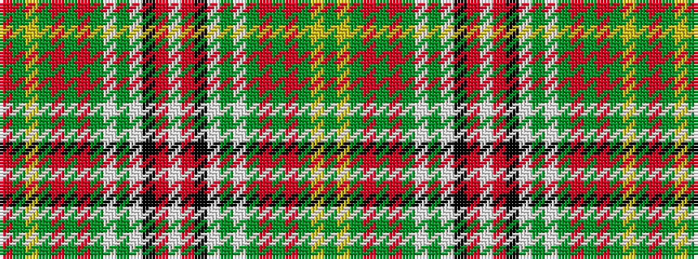

GYGRGRGWGWKRWRKWGWGRGRGYGR

It is a 26 stripe tartan.

<figure class="pat-woven">

<figcaption>idealised sample</figcaption>
</figure>

## Colour Sequence



## Tartans with this colour sequence

| Tartans |
|---------------|
| [Hay, White Dress](/setts/s26/r3g2ly2g14r2g3r2g3w17g2w2k2r2w3~x2/)|
||
