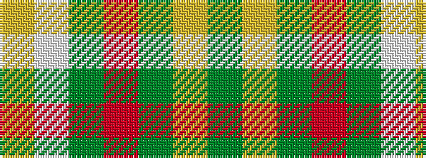

GYGRGWY

It is a 7 stripe tartan.

<figure class="pat-woven">

<figcaption>idealised sample</figcaption>
</figure>

## Colour Sequence



## Tartans with this colour sequence

| Tartans |
|---------------|
| [Dalveen (2004)](/setts/s7/lg22w1g6r6g6ly3g12~x2/)|
||
