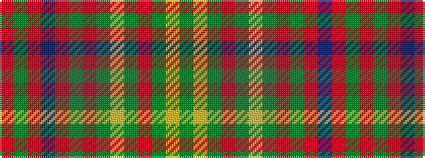

GYGRGYGRGRBRGR

It is a 14 stripe tartan.

<figure class="pat-woven">

<figcaption>idealised sample</figcaption>
</figure>

## Colour Sequence



## Tartans with this colour sequence

| Tartans |
|---------------|
| [Burnett of Powis (Modern) (Personal)](/variants/s14/y19ly3y19r3y19ly3y19r3y3r21t3r21y3r3~x2/)|
||
