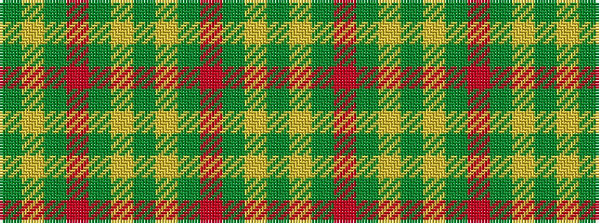

GYGRGYGYGRGYG

It is a 13 stripe tartan.

<figure class="pat-woven">

<figcaption>idealised sample</figcaption>
</figure>

## Colour Sequence



## Tartans with this colour sequence

| Tartans |
|---------------|
| [Terry](/variants/s13/y33lo1y3r3g3lo1g21lo1g3r3g3lo1g21~x2/)|
||
| [Terry](/variants/s13/gi33ly1gi3r3g3ly1g21ly1g3r3g3ly1g21~x2/)|
||
