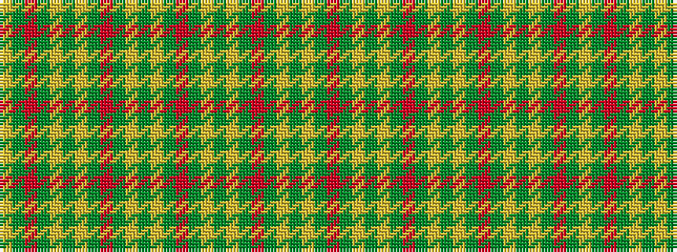

GYGRGYGYGRGYGYGRGYGYGRGY

It is a 24 stripe tartan.

<figure class="pat-woven">

<figcaption>idealised sample</figcaption>
</figure>

## Colour Sequence



## Tartans with this colour sequence

| Tartans |
|---------------|
| [Terry Clan/Family Weavers Tartan](/variants/s24/y33lo1y3r3g3lo1g21lo1g3r3g3lo1g21~x2/)|
||
