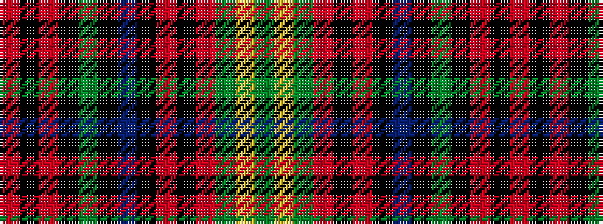

GYGRKRKBKGKRKR

It is a 14 stripe tartan.

<figure class="pat-woven">

<figcaption>idealised sample</figcaption>
</figure>

## Colour Sequence



## Tartans with this colour sequence

| Tartans |
|---------------|
| [Golden Broom #2](/setts/s14/y12ly3y6ri19k1r8k2n4k2y19k1ri19k1r9~x2/)|
||
