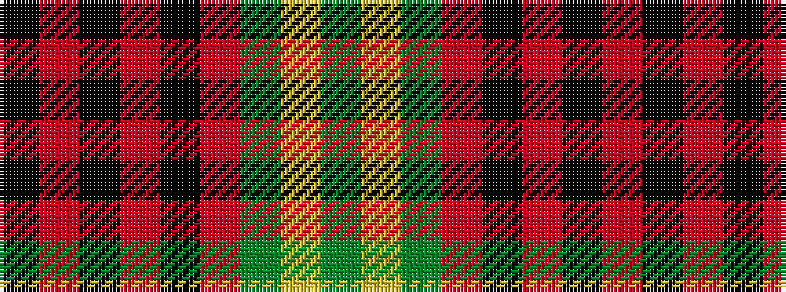

GYGRKRKRK

It is a 9 stripe tartan.

<figure class="pat-woven">

<figcaption>idealised sample</figcaption>
</figure>

## Colour Sequence



## Tartans with this colour sequence

| Tartans |
|---------------|
| [Durie](/variants/s9/k12r1k1r1k1r4dg12ly1dg2~x4/)|
||
