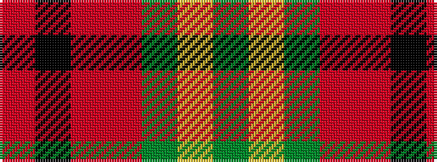

GYGRRKR

It is a 7 stripe tartan.

<figure class="pat-woven">

<figcaption>idealised sample</figcaption>
</figure>

## Colour Sequence



## Tartans with this colour sequence

| Tartans |
|---------------|
| [Unidentified Printing #3](/variants/s7/dg2ly1dg6ri4r6k1r2~x4/)|
||
